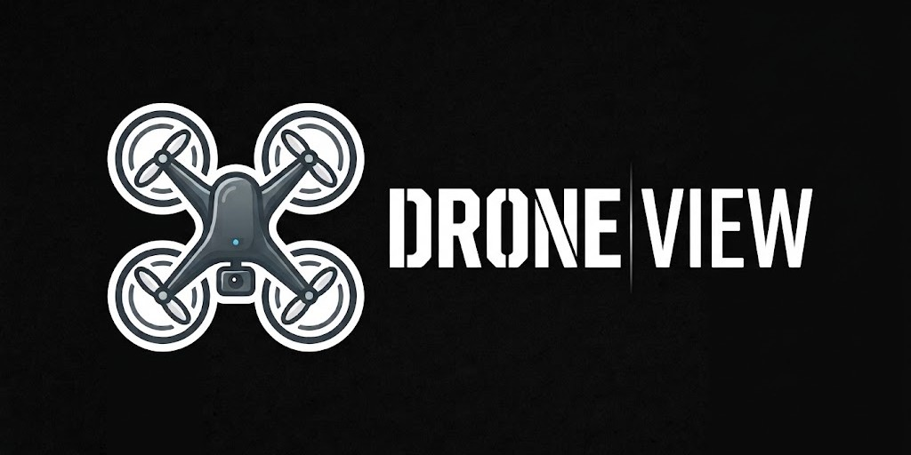
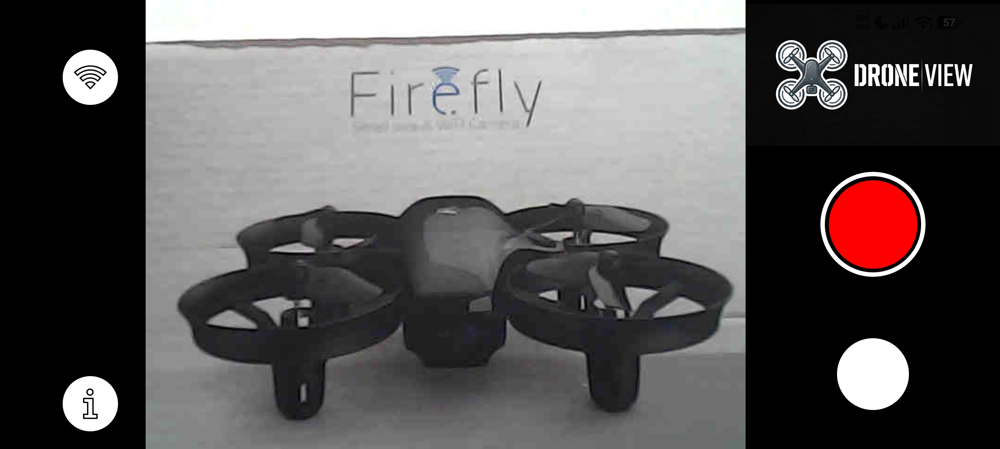

  

# DroneView

## Description

DroneView is an Android camera app that connects to *Potensic A20W* drone's camera for visualization and recording.
This app is a modern substitute of the old *Potensic* app, given that it is not compatible with newer Android versions.

  

## Compatibility

DroneView compatibility has only been tested with ***Potensic A20W*** drone. Any other device, including other drones from the same brand, are not guaranteed to be compatible. Additionally, it requires **Android 11 (or higher)** to work properly.

## Functionalities

DroneView offers multiple functionalities:

- **Connectivity check:** connectivity feedback is given to the user to make sure the phone is connected to the drone's WiFi network.
- **Live video visualization:** once connected, video is streamed on the screen.
- **Video/photo recording:** video and photo recording buttons are available.

## Limitations

- **Drone info absence:** only connectivity feedback is provided, other pieces of information, such as battery, are not accesible from the app.
- **Frame streaming is disfunctional:** partial frames are displayed frequently. The root cause of this issue is unknown. Hardware malfunctioning, communication interferences or a software bug are plausible explanations.
